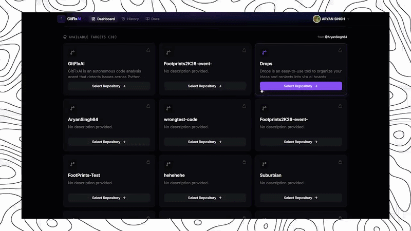
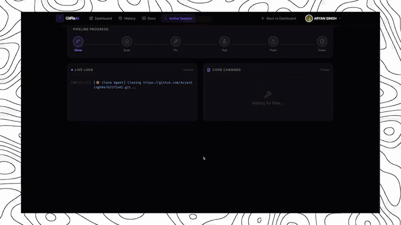

<div align="center">

  

  <h1>GitFixAI</h1>

  <p><strong>Autonomous code healing powered by AI</strong></p>
  <p>Scan. Fix. Test. Ship.</p>

  <br/>

  <a href="https://gitfixai.vercel.app"></a>

  <br/><br/>

  
  
  
  
  

</div>

<br/>

---

##  What is GitFixAI?

GitFixAI is an autonomous code analysis agent that detects issues across Python, JavaScript, TypeScript, and Go codebases. It uses AI to fix bugs, runs tests, and creates Pull Requests automatically — all from a single click.

---

##  Key Features

###  Multi-Language Support
Analyzes Python, JavaScript, TypeScript, Go with unified linting (flake8, ESLint, go vet, and more).

###  AI-Powered Fixes
Uses OpenAI/Gemini to understand full file context and fix multi-line bugs automatically.

###  Autonomous Test Healing
Discovers test frameworks, runs tests, and loops until all issues are resolved.

###  GitHub Integration
Connects via OAuth, creates feature branches, commits fixes, and opens Pull Requests.

###  Live Dashboard
Real-time WebSocket-powered analysis with animated score gauge, live logs, and diff viewer.

###  Production Hardened
Per-user WebSocket sessions, rate limiting, security headers, and environment validation.

---

##  Quick Start

```bash
# Clone the repository
git clone https://github.com/AryanSingh64/GItFIxAI.git
cd GItFIxAI

# One-click start (Windows)
.\start.bat

# Or manually:
cd frontend && npm install && npm run dev
cd ../backend && pip install -r requirements.txt && python main.py
```

Open [http://localhost:5173](http://localhost:5173) in your browser.

---

##  Demo

<div align="center">

### Landing Page


### Dashboard


### Live Analysis


### Results


</div>

---

##  Tech Stack

**Frontend:**


**Backend:**


**AI & Tools:**


**Deployment:**


---

##  Installation

<details>
<summary><strong>Click to expand full installation steps</strong></summary>

### Prerequisites
- Node.js 18+
- Python 3.9+
- A GitHub account
- (Optional) OpenAI or Google Gemini API key

### 1. Clone the repo

```bash
git clone https://github.com/AryanSingh64/GItFIxAI.git
cd GItFIxAI
```

### 2. Frontend setup

```bash
cd frontend
npm install
```

### 3. Backend setup

```bash
cd backend
pip install -r requirements.txt
```

### 4. Environment variables

Create `frontend/.env`:
```bash
VITE_SUPABASE_URL=your-supabase-url
VITE_SUPABASE_ANON_KEY=your-anon-key
VITE_GITHUB_CLIENT_ID=your-github-client-id
VITE_API_URL=http://localhost:8000
```

Create `backend/.env`:
```bash
GITHUB_CLIENT_ID=your-github-client-id
GITHUB_CLIENT_SECRET=your-github-client-secret
OPENAI_API_KEY=your-openai-key          # optional
GOOGLE_API_KEY=your-gemini-key          # optional
SUPABASE_URL=your-supabase-url
SUPABASE_SERVICE_KEY=your-service-key
```

### 5. Start

```bash
# Windows (one-click):
.\start.bat

# Or manually:
# Terminal 1 (backend):
cd backend && python main.py

# Terminal 2 (frontend):
cd frontend && npm run dev
```

</details>

---

##  Configuration

The dashboard provides a UI for all configuration. You can also customize defaults:

| Setting | Default | Description |
|---------|---------|-------------|
| `Auto-Fix: Syntax` | On | Fix syntax errors automatically |
| `Auto-Fix: Imports` | On | Fix import issues |
| `Auto-Fix: Formatting` | On | Apply code formatting |
| `Auto-Fix: Security` | Off | Fix security vulnerabilities |
| `Commit Message` | `Fixed {issues_count} issues...` | Template with variables |

---

##  How It Works

```
1. CLONE     → Clones repository to temp directory
2. SCAN      → Runs language-specific linters (flake8, ESLint, go vet)
3. FIX       → AI agent applies targeted fixes per issue
4. TEST      → Discovers and runs test suites
5. PUSH      → Creates branch, commits fixes, opens Pull Request
```

The agent loops SCAN → FIX up to 3 iterations to catch cascading issues.

---

##  Security & Production

| Feature | Status |
|---------|--------|
| Per-user WebSocket sessions | Active |
| Rate limiting (5 req/min) | Active |
| Security headers (XSS, Clickjack, HSTS) | Active |
| Environment validation | Active |
| CI/CD pipeline (GitHub Actions) | Active |
| OAuth 2.0 (Google + GitHub) | Active |

---

##  Contributing

Contributions are welcome!

1. Fork the repository
2. Create feature branch (`git checkout -b feature/amazing`)
3. Commit changes (`git commit -m 'Add feature'`)
4. Push to branch (`git push origin feature/amazing`)
5. Open Pull Request

---

##  License

This project is licensed under the MIT License — see [LICENSE](LICENSE) for details.

---

<div align="center">

  

  <p>Made with  by <a href="https://github.com/AryanSingh64">Aryan Singh</a></p>

  <a href="https://gitfixai.vercel.app">Live Demo</a> ·
  <a href="https://github.com/AryanSingh64/GItFIxAI">GitHub</a> ·
  <a href="https://gitfixai.vercel.app/docs">Documentation</a>

</div>
